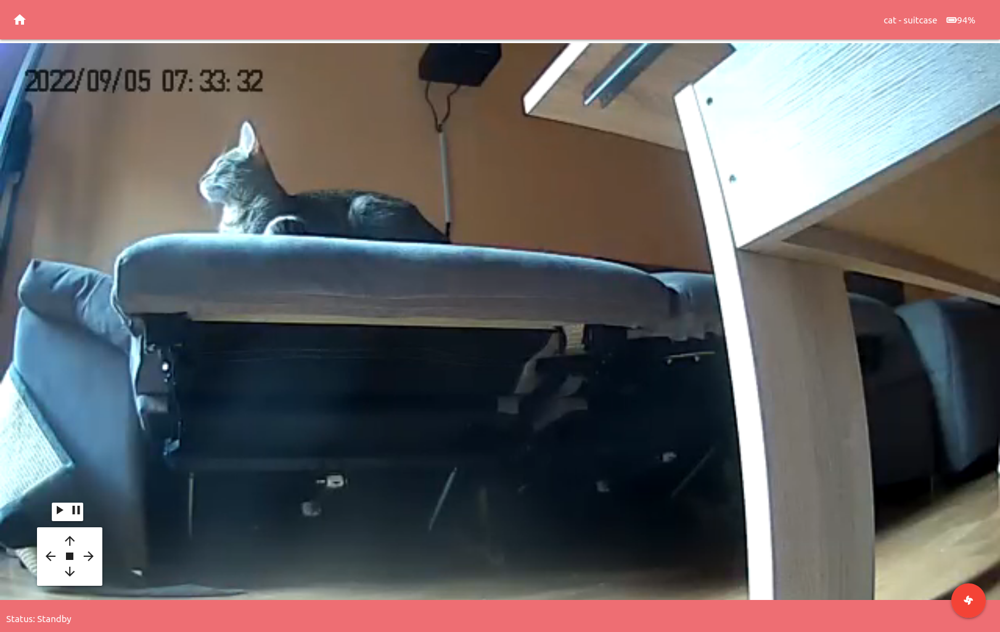

.. figure:: ./docs/ackack.jpg
   :width: 200px

   (Creative Commons Attribution-Noncommercial-No Derivative Works 3.0 License, Author Wonder Waffle https://www.deviantart.com/wonder-waffle/art/ACK-ACK-Mars-Attacks-359710975 )

|pypi| |release| |downloads| |python_versions| |pypi_versions| |actions|

.. |pypi| image:: https://img.shields.io/pypi/l/ackack
.. |release| image:: https://img.shields.io/librariesio/release/pypi/ackack
.. |downloads| image:: https://img.shields.io/pypi/dm/ackack
.. |python_versions| image:: https://img.shields.io/pypi/pyversions/ackack
.. |pypi_versions| image:: https://img.shields.io/pypi/v/ackack
.. |actions| image:: https://github.com/XayOn/ackack/workflows/CI%20commit/badge.svg
    :target: https://github.com/XayOn/ackack/actions

**Have fun with your vaccuum robot!**

AckAck is a simple control API to manually controll weback vacuum robots.
Paired with its web interface, and a RTPS (in my case, I'm using an old yi ants
camera with `yi-hack <https://github.com/fritz-smh/yi-hack>`_)

This way you can remotely-scare your cats! 

Keys
----

Use your arrow keys to move the robot left, right, go front or turn backwards.
Enter will start cleaning and backspace will stop.

Environment variables
---------------------

You'll need to setup your weback username and password.
Usually, this will be your phone + the password you use on the control app.
Besides that, only RTSP_URL is required.

===============  =====================================
KEY               Description
===============  =====================================
RTSP_URL         Yi camera's RTSP stream URL 
WEBACK_USERNAME  Your weback's username (phone number)
WEBACK_PASSWORD  Your weback's password
BASE_URL         Base URL, for reverse proxies
===============  =====================================

Installation
------------

Docker
++++++

With docker, just setup the specified env vars and launch the image.
You can use the following docker-compose.yml example.
Setting base_url is useful in reverse proxy scenarios (like traefik).

.. code:: yaml

    version: "3.3"
    services:
      ackack:
        image: XayOn/ackack
        restart: unless-stopped
        ports:
          - 8080:8080
        environment:
          RTSP_URL: http://192.168.1...
          WEBACK_USERNAME: +33-123123123
          WEBACK_PASSWORD: yourpassword 
          BASE_URL: /ackack

Manual setup
++++++++++++

Install the project, set your environment variables, launch ffmpeg to create a
m3u8 file in static/playlist.m3u8 from your rtsp.

Requires ffmpeg. Check your distro's instructions on how to install ffmpeg
You can checkout docker-entrypoint.sh and use its ffmpeg command

.. code:: bash

   pip install ackack
   WEBACK_USERNAME="+34-XXXX" WEBACK_PASSWORD="XXXX" poetry run uvicorn ackack:app

How does it work?
-----------------

Ackack is simply an API for movement commands on python's `weback unofficial
library <https://github.com/opravdin/weback-unofficial>`_, with an interface in
plain html + js (with just videojs, minimal), paired with an ffmpeg command
that converts the rtsp output of the yi camera to a format playable by your
browser.
